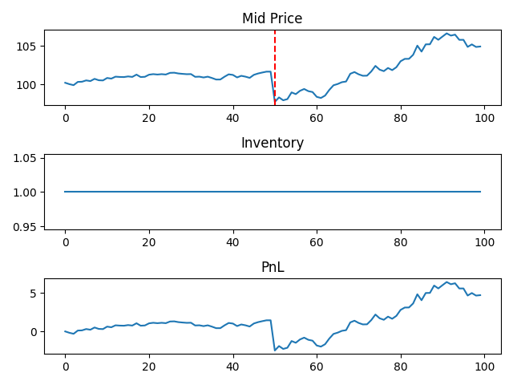

# Market_maker
Some simple market making simulations in python.
## Simple Market Maker
- Mid Price modelled as a normally distributed random walk.
- Constant Spread.
- Bid/Ask filled with a constant probability 30% each time.

  

<em>Figure 1: PnL over Time</em>

## Modelling Market Volitilty
- Mid Price is a normally distributed random walk with increased standard deviation halfway through for modelling volitility.
- Spread takes a constant value.
- Bid/Ask is filled with probability of 30% each time unless inventory exceeds 10 or -10, then remains unfilled.

  

<em>Figure 2: PnL over Time in Volatile Market</em>

## Modelling random Market Shock
- A random increase or decrease in Mid Price as a shock (red line in plot).
- Probability of Bid/Ask being filled now directly dependent on the distance from Mid Price.
- PnL plotted with penalty for increased risk (particularly high or low inventory).
  

  

<em>Figure 3: Mid Price, Inventory and Weighted PnL over Time during a shock in the market</em>

