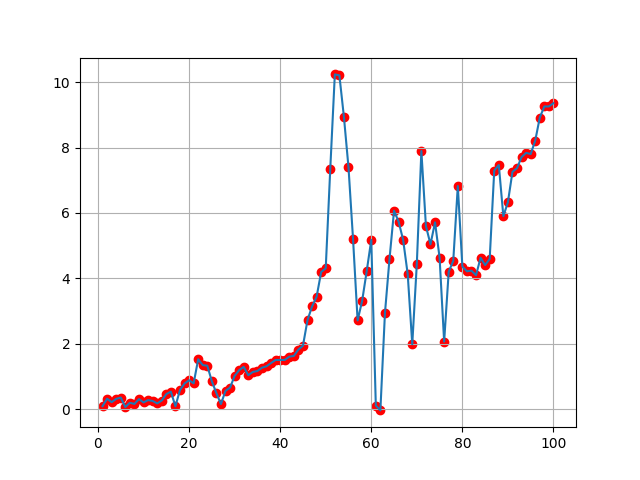

# Market_maker
Some simple market making simulations in python.
## Simple Market Maker
- Mid Price modelled as a normally distributed random walk.
- Constant Spread.
- Bid/Ask filled with a constant probability 30% each time.

  

## Modelling Market Volitilty
- mid price is a normally distributed random walk with increased sd halfway through for volitility
- the spread takes a constant value
- the bid/ask is filled with probability of 30% each time unless inventory exceeds 10 or -10

  

